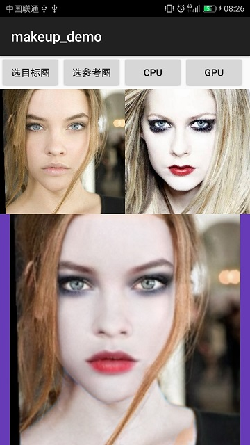

# ncnn_MakeupTransfer    
## SSAT Makeup/Makeup Transfer infer by  ncnn  
The ncnn demo of **SSAT: A Symmetric Semantic-Aware Transformer Network for Makeup Transfer and Removal**  

## Result  
### android  
  
### linux  
  
### windows  

## Reference  
1.https://github.com/Snowfallingplum/SSAT  
2.https://github.com/zllrunning/face-parsing.PyTorch  
3.https://github.com/Tencent/ncnn  
